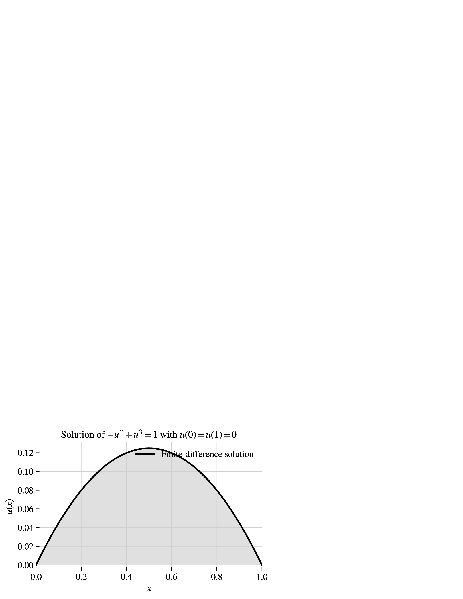

# NonlinearBVP

(This README.md file was also written by an AI Coding Agent, except for this comment. Despite one attempt at fixing it, the white spacing around the figure couldn't be resolved.) 

This repository contains a small finite-difference and Newton-solver example for the nonlinear boundary value problem

`-u''(x) + u(x)^3 = 1` for `x in [0,1]`, with boundary conditions `u(0) = u(1) = 0`.

The problem is discretized with second-order centered finite differences using `N = 200` interior grid points, and the resulting nonlinear algebraic system is solved with Newton's method equipped with an Armijo backtracking line search.

This repository accompanies the essay *"The Future of Computational Mathematics with AI Coding Agents"* by Alex Townsend, submitted to *AMS Notices*.

## Contents

- `nonlinear_bvp/solver.py`: residual, Jacobian, and damped Newton solver for the discretized problem.
- `scripts/plot_solution.py`: script that computes the numerical solution and saves a publication-style EPS figure.
- `tests/test_solver.py`: unit tests, including a check of quadratic convergence in the local Newton regime.

## Usage

Install the lightweight Python requirements and run the tests:

```bash
pytest -q
```

Generate the figure:

```bash
python3 scripts/plot_solution.py
```

This writes `nonlinear_bvp_solution.eps`. A PNG rendering is also included below for convenient display on GitHub.

## Computed solution


